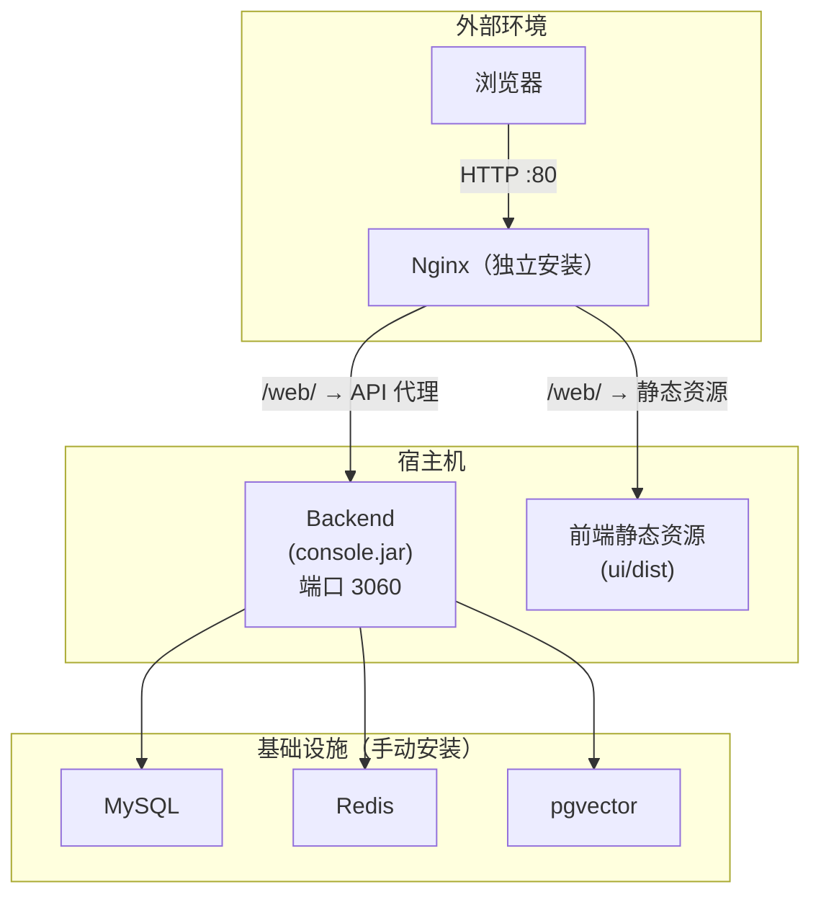
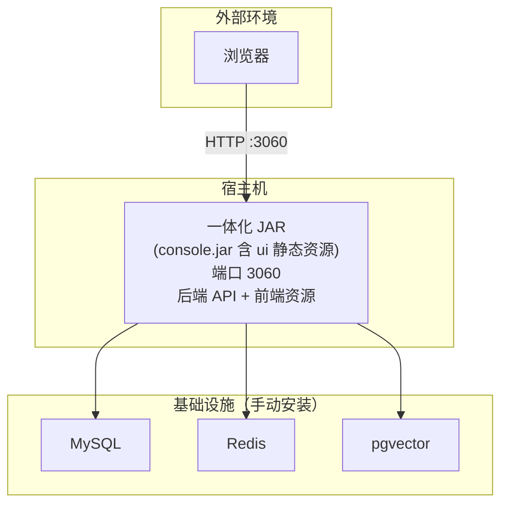
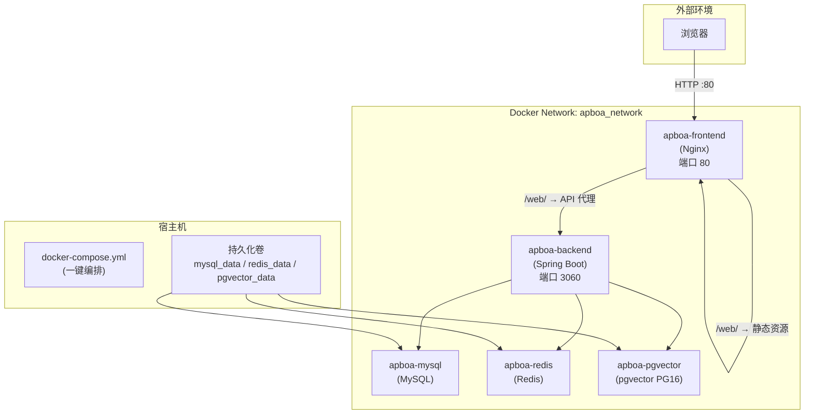
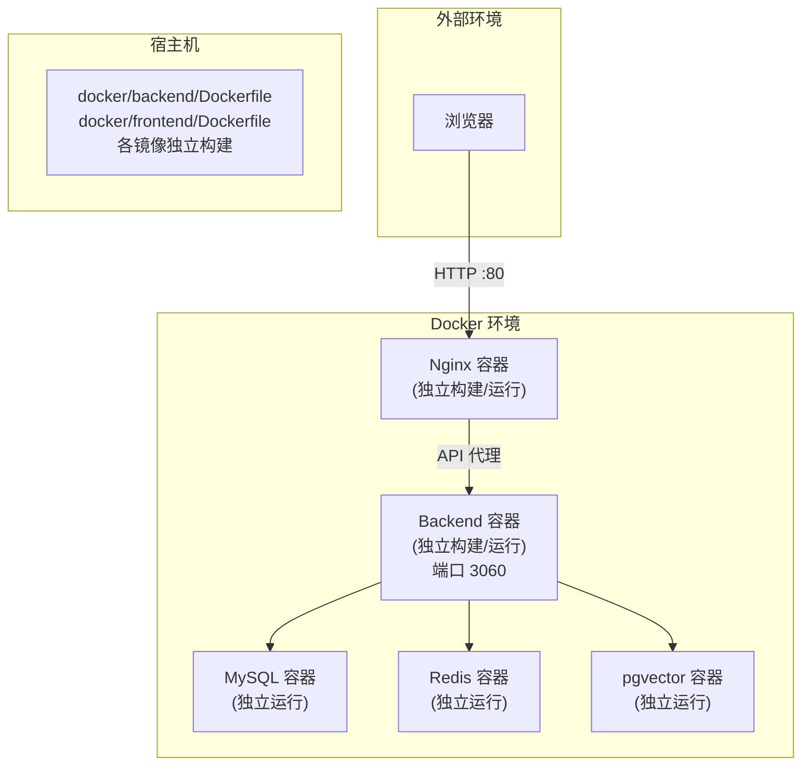
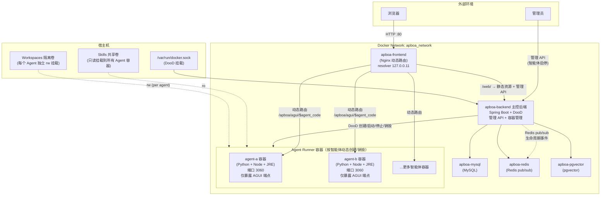

# 打包构建与部署

本文档介绍智能体平台的五种部署方案，从开发环境到生产环境的完整指南。


## 一、环境要求

### 后端环境

| 依赖 | 版本要求 | 说明 |
|------|----------|------|
| **JDK** | 21+ | Java 运行与编译环境 |
| **Maven** | 3.8+ | Java 项目构建工具 |
| **MySQL** | 8.0+ | 数据库 |
| **Redis** | 6.0+ | 缓存与消息中间件 |

### 前端环境

| 依赖 | 版本要求 | 说明 |
|------|----------|------|
| **Node.js** | ^20.19.0 或 >=22.12.0 | JavaScript 运行环境 |
| **pnpm** | 最新版 | 包管理器（项目使用 pnpm） |

### Docker 环境（方案三 / 四 / 五）

| 依赖 | 版本要求 | 说明 |
|------|----------|------|
| **Docker** | >= 20.10 | 容器引擎 |
| **Docker Compose** | >= 2.0 | 容器编排 |


## 二、数据库初始化

:::info 前提条件
确保 MySQL 服务已启动。
:::

```sql
-- 创建数据库（如尚未创建）
CREATE DATABASE IF NOT EXISTS `apboa` DEFAULT CHARACTER SET utf8mb4 COLLATE utf8mb4_unicode_ci;
```

执行项目 `docs/once_db_init/` 下的初始化脚本：

```bash
mysql -u root -p apboa < docs/once_db_init/db_init.sql
```

:::warning 提醒
db_init.sql 已包含建库语句（`CREATE DATABASE IF NOT EXISTS`）和全量表结构及初始数据，一条命令即可完成初始化。
:::


## 三、部署方案对比

| 方案 | 适用场景 | 复杂度 | 依赖项 |
|------|---------|--------|--------|
| 方案一：前后端分离 | 传统部署，灵活可控 | 中等 | 自行安装 MySQL/Redis |
| 方案二：一体化 JAR | 单机快速部署 | 低 | 自行安装 MySQL/Redis |
| 方案三：Dockerfile 自定义 | 手动构建镜像，灵活可定制 | 较高 | Docker |
| 方案四：Docker Compose | 一键编排，开箱即用 | 低 | Docker |
| 方案五：Agent 容器化隔离 | 智能体独立容器，ToB 多租户 | 高 | Docker |


## 四、方案一：前后端分离部署

手动构建前后端，分别部署到服务器。前端通过 Nginx 托管，API 请求反向代理到后端。

### 4.1 构建后端

```bash
# 在项目根目录执行
mvn clean package -DskipTests -pl console -am
```

构建产物：`console/target/console-1.0-SNAPSHOT.jar`

启动后端：

```bash
java -jar console/target/console-1.0-SNAPSHOT.jar
```

可指定 Profile：

```bash
java -jar console/target/console-1.0-SNAPSHOT.jar --spring.profiles.active=prod
```

### 4.2 构建前端

```bash
cd ui
pnpm install
```

生产构建：

| 构建命令 | 说明 | 产物 |
|----------|------|------|
| `pnpm build` | 构建主应用 + 文档子应用 | `dist/main.html` + `dist/doc.html` |
| `pnpm build:main` | 仅构建主应用 | `dist/main.html` |
| `pnpm build:doc` | 仅构建文档子应用 | `dist/doc.html` |

构建产物位于 `ui/dist/`，同时自动生成 `ui/dist-zip/dist.zip`。

### 4.3 Nginx 部署配置

将 `ui/dist/` 目录上传到服务器，参考以下 Nginx 配置：

```nginx
server {
    listen 80;
    server_name your-domain.com;

    # 前端静态资源（主应用）
    location / {
        root /path/to/dist;
        try_files $uri $uri/ /main.html;
    }

    # 文档子应用
    location /doc {
        root /path/to/dist;
        try_files $uri $uri/ /doc.html;
    }

    # API 反向代理（后端 ApiPathRewriteFilter 自动剥离 /api 前缀）
    location /api/ {
        proxy_pass http://127.0.0.1:3060/;
        proxy_set_header Host $host;
        proxy_set_header X-Real-IP $remote_addr;
        proxy_set_header X-Forwarded-For $proxy_add_x_forwarded_for;
        proxy_read_timeout 300s;
        proxy_send_timeout 300s;
    }
}
```

:::info 路径兼容说明
后端 `ApiPathRewriteFilter` 自动剥离 `/api/` 和 `/web/api/` 请求前缀，因此开发环境（Vite 代理）和生产环境（Nginx）均可使用 `/api` 前缀，无需额外配置。
:::


### 4.4 服务架构




## 五、方案二：前后端一体化 JAR

将前端构建产物嵌入后端 JAR，一个文件即可运行完整系统。

### 5.1 启用 UI 模块

编辑 `console/pom.xml`，取消 `ui` 依赖的注释：

```xml
<dependency>
    <groupId>com.hxh.apboa</groupId>
    <artifactId>ui</artifactId>
</dependency>
```

### 5.2 打包

```bash
mvn clean package -DskipTests
```

构建产物：`console/target/console-1.0-SNAPSHOT.jar`（内含前端静态资源）。

### 5.3 启动

```bash
java -jar console/target/console-1.0-SNAPSHOT.jar
```

访问 `http://localhost:3060` 即可打开系统。

:::warning 注意
一体化 JAR 的前端资源每次打包都会重新构建，首次构建耗时较长。开发阶段建议使用方案一的前后端分离模式。
:::

### 5.4 服务架构




## 六、方案三：Dockerfile 自定义部署

基于项目提供的 Dockerfile 自行构建镜像，适用于集成到已有容器平台的场景。

### 6.1 构建后端镜像

```bash
# 在项目根目录执行
docker build \
  -f docker/backend/Dockerfile \
  -t apboa-backend:latest \
  .
```

### 6.2 构建前端镜像

```bash
docker build \
  -f docker/frontend/Dockerfile \
  --build-arg VITE_APP_BASE_API=/web \
  --build-arg VITE_APP_CONTEXT_PATH=/web \
  -t apboa-frontend:latest \
  .
```

### 6.3 运行容器

```bash
# 创建网络
docker network create apboa_network

# 启动后端（确保 MySQL / Redis 已就绪）
docker run -d \
  --name apboa-backend \
  --network apboa_network \
  -e SPRING_PROFILES_ACTIVE=docker \
  -e MYSQL_HOST=your-mysql-host \
  -e MYSQL_PASSWORD=your_password \
  -e REDIS_HOST=your-redis-host \
  -e REDIS_PASSWORD=your_password \
  -p 3060:3060 \
  apboa-backend:latest

# 启动前端
docker run -d \
  --name apboa-frontend \
  --network apboa_network \
  -p 80:80 \
  apboa-frontend:latest
```

### 6.4 Dockerfile 文件说明

| 文件 | 用途 |
|------|------|
| `docker/backend/Dockerfile` | Maven 多阶段构建后端 JAR，JRE 运行镜像 |
| `docker/frontend/Dockerfile` | Node / pnpm 多阶段构建前端，Nginx 运行镜像 |
| `docker/nginx/nginx.conf` | Nginx 反向代理配置模板 |
| `docker/maven/settings.xml` | Maven 私有仓库配置（离线部署） |
| `docker/npm/.npmrc` | NPM 私有仓库配置（离线部署） |


### 6.5 服务结构



## 七、方案四：Docker Compose 一键部署

一键启动 MySQL、Redis、pgvector（向量库）、后端、前端全部服务。

### 7.1 配置

编辑 `docker/.env`，按需修改密码等配置：

```bash
MYSQL_ROOT_PASSWORD=your_password
REDIS_PASSWORD=your_password
PG_PASSWORD=your_password
JWT_SECRET=your_secret
```

### 7.2 启动

```bash
# 构建并启动
cd docker
docker compose up -d --build
```


```bash
# 停止服务
docker compose down

# 停止服务，并清理数据（慎用！！！）
docker compose down -v
```


```bash
docker compose stop   # 停止所有
docker compose start  # 启动所有（不重新构建）
```


```bash
# 重新构建后端（不使用缓存）
docker compose build --no-cache apboa-backend

# 重新构建并启动
docker compose up -d --build apboa-backend
```


```bash
# 重新构建所有镜像
docker-compose build --no-cache

# 或构建并启动
docker-compose up -d --build
```

### 7.3 访问

- 主应用：`http://localhost/web/`
- 默认管理员：`admin` / `Admin@123.com`

### 7.4 服务架构



### 7.5 使用外置服务

如果已有外部 MySQL / Redis / pgvector / Elasticsearch，修改 `.env` 中的 `*_HOST` 或 `ELASTICSEARCH_URIS` 为外部地址，并注释 `docker-compose.yml` 中对应服务块。

### 7.6 离线部署

内网环境下需配置私有仓库，详见 `docker/README.md` 中的"离线/内网部署"章节。


## 八、方案五：Agent 容器化隔离部署（暂未上线）

每个智能体拥有独立的 Docker 容器运行环境，实现文件系统和 Shell 执行的安全隔离，适用于云部署场景。

### 8.1 方案概述

在日常使用中，智能体可能需要创建/修改/删除文件，或执行 Shell 命令。在方案一至四中，所有智能体共享同一个后端进程的文件系统和 Shell 环境，存在以下安全风险：

- 智能体 A 可能误删智能体 B 的工作文件
- 恶意代码执行可能影响宿主机或其他智能体
- 无法对单个智能体进行资源限制（CPU / 内存）

方案五通过为每个智能体创建独立 Docker 容器来解决这些问题，核心设计如下：

| 特性 | 说明 |
|------|------|
| **容器粒度** | 一个智能体 = 一个独立容器，启用时自动创建，禁用时自动销毁 |
| **文件隔离** | 每个智能体拥有独立的 Workspace 卷（读写），容器间不可互访 |
| **技能共享** | Skills 目录以只读方式挂载到所有 Agent 容器，一次部署全局生效 |
| **Shell 沙箱** | 所有 Shell 命令在容器内部执行，与宿主机和其他智能体完全隔离 |
| **资源限制** | 可对每个 Agent 容器设置 CPU 份额和内存上限，防止单容器耗尽资源 |
| **动态路由** | Nginx 根据 URL 中的 `agent_code` 将 AGUI 请求动态路由到对应容器 |
| **容器管理** | 主控后端通过 DooD 模式（挂载 `/var/run/docker.sock`）管理 Agent 容器生命周期 |
| **安全加固** | Agent Runner 容器仅暴露 AGUI 端点，所有管理 API 返回 403 |

### 8.2 架构图



### 8.3 前置要求

| 依赖 | 版本要求 | 说明 |
|------|----------|------|
| **Docker** | >= 20.10 | 主控后端容器需挂载宿主机 `/var/run/docker.sock` |
| **Docker Compose** | >= 2.0 | 容器编排 |
| **宿主机内存** | >= 8GB | 主控后端 + 中间件 + N 个 Agent 容器（每个默认 512MB） |
| **宿主机磁盘** | >= 20GB | 镜像构建缓存 + 各智能体 Workspace 数据 |

:::warning 注意
方案五与方案三/四使用不同的部署目录和配置文件，不可混用：
- 方案三/四 → `docker/` 目录
- 方案五 → `docker-agent/` 目录
:::

### 8.4 快速开始

#### 1. 配置环境变量

编辑 `docker-agent/.env`，按需修改密码和资源配置：

```bash
# 必改项（生产环境）
MYSQL_ROOT_PASSWORD=your_strong_password
REDIS_PASSWORD=your_redis_password
PG_PASSWORD=your_pg_password
JWT_SECRET=your_jwt_secret

# Agent 容器默认资源配置（可选，运维可根据服务器规格调整）
AGENT_MEMORY_MB=512          # 每个 Agent 容器的内存上限（MB）
AGENT_CPU_SHARES=512         # 每个 Agent 容器的 CPU 份额（相对权重，默认 512）
```

#### 2. 构建并启动

```bash
# 进入方案五部署目录
cd docker-agent

# 构建并启动所有服务
# 首次构建会编译主控后端镜像 + Agent Runner 基础镜像（含 Python 3 + Node.js 22）
docker compose up -d --build
```

首次构建耗时约 5-10 分钟，后续增量构建会利用 Docker 层缓存大幅加速。

#### 3. 访问系统

- 主应用：`http://localhost/web/`
- 默认管理员：`admin` / `Admin@123.com`

#### 4. 验证容器化隔离

在管理后台启用一个智能体后，通过以下命令验证 Agent 容器是否自动创建：

```bash
# 查看所有 Agent 容器
docker ps --filter "name=agent-"

# 查看特定 Agent 容器日志
docker logs -f agent-<agent_code>

# 查看容器资源使用
docker stats --filter "name=agent-"
```

### 8.5 常用运维命令

```bash
# 停止所有服务
docker compose down

# 停止服务但保留数据
docker compose stop

# 重新构建特定服务
# 如修改了后端代码，重新构建主控后端
docker compose build --no-cache apboa-backend
docker compose up -d apboa-backend

# 如修改了 Agent Runner 镜像配置，重新构建基础镜像
docker compose build --no-cache agent-runner-image
docker compose up -d agent-runner-image

# 查看所有服务状态
docker compose ps

# 查看各服务日志
docker compose logs -f apboa-backend
docker compose logs -f apboa-frontend
```

### 8.6 智能体生命周期

智能体的启用/禁用与容器创建/销毁完全联动，由 Redis pub/sub 消息驱动，无需人工干预：

```
  管理员 启用 智能体
        │
        ▼
  后端更新数据库状态（enabled = true）
        │
        ▼
  后端发布 Redis 消息
  Channel: apboa:agent:cluster:register
        │
        ▼
  AgentContainerLifecycleListener 监听到消息
        │
        ▼
  AgentContainerManager.createContainer(agentCode)
        │
        ├── 1. 在宿主机创建 Workspace 目录
        │      /app/.apboa/workspaces/{agentCode}/
        │
        ├── 2. 调用 Docker API 创建容器
        │      - 挂载 Workspace 目录（读写）
        │      - 挂载 Skills 目录（只读）
        │      - 加入 apboa_network 网络
        │      - 应用 CPU / 内存限制
        │      - 设置容器名 = agent-{agentCode}
        │
        ├── 3. 启动容器
        │
        └── 4. Nginx 动态路由自动生效
               URL /apboa/agui/{agentCode}/*
               → http://agent-{agentCode}:3060
```

禁用智能体时流程相反，容器会被停止并删除，但 Workspace 数据会保留在宿主机上：

```
  管理员 禁用 智能体
        │
        ▼
  后端发布 Redis 消息
  Channel: apboa:agent:cluster:unregister
        │
        ▼
  AgentContainerLifecycleListener 监听到消息
        │
        ▼
  AgentContainerManager.removeContainer(agentCode)
        │
        ├── docker stop agent-{agentCode}
        ├── docker rm agent-{agentCode}
        └── Workspace 数据保留，不删除
```

:::info Workspace 数据保留
禁用智能体时，Workspace 数据不会自动删除。如需彻底清理，请手动删除宿主机上 `docker-agent/data/workspaces/{agentCode}/` 目录。
:::

### 8.7 Nginx 动态路由原理

方案五的 Nginx 配置与传统反向代理不同，使用了 Docker 内嵌 DNS 实现运行时动态路由：

```nginx
# 动态路由：从 URL 中提取 agent_code，路由到同名容器
location ~ ^/apboa/agui/(?<agent_code>[a-z0-9_-]+)(?<remaining>/.*)?$ {
    resolver 127.0.0.11 ipv6=off;

    # 使用 $remaining 确保路径完整传递
    proxy_pass http://$agent_code:3060$remaining$is_args$args;

    proxy_set_header Host $host;
    proxy_set_header X-Real-IP $remote_addr;
    proxy_set_header X-Forwarded-For $proxy_add_x_forwarded_for;
    proxy_set_header X-Forwarded-Proto $scheme;
    proxy_set_header X-Agent-Code $agent_code;

    proxy_http_version 1.1;
    proxy_set_header Upgrade $http_upgrade;
    proxy_set_header Connection "upgrade";

    proxy_read_timeout 3600s;
    proxy_send_timeout 3600s;
    proxy_buffering off;
}
```

**工作原理**：

1. Nginx 正则匹配 URL 中的 `agent_code`（如 `/apboa/agui/my-agent/chat` → `agent_code = my-agent`）
2. 将 `agent_code` 作为主机名，通过 Docker DNS（`127.0.0.11`）解析为容器 IP
3. 代理请求到对应 Agent Runner 容器
4. 如果容器不存在，Docker DNS 解析失败，Nginx 返回 502

核心前提：**Agent Runner 容器的 `container_name` 必须与 `agent_code` 一致**，这样 Docker DNS 才能通过容器名解析到对应 IP。

### 8.8 安全设计

方案五从多个层面保障多租户安全：

#### 8.8.1 网络隔离

- 所有容器位于独立 Docker 网络 `apboa_network`，与宿主机网络隔离
- Agent Runner 容器**仅暴露 `/apboa/agui/` 端点**，任何对管理 API 的请求返回 403
- 安全机制：`AgentModeSecurityConfig` Filter（`@Profile("agent")`）在请求进入 Controller 之前拦截

#### 8.8.2 文件系统隔离

- 每个 Agent 容器挂载独立的 Workspace 卷（读写），容器间完全不可互访
- Skills 目录以只读方式共享挂载，Agent 容器无法修改或删除技能包内容
- 容器内拥有独立文件系统，无法访问宿主机或其他容器的文件

#### 8.8.3 数据库迁移权责分离

| 服务 | 数据库迁移 | 说明 |
|------|-----------|------|
| 主控后端（apboa-backend） | ✅ 执行 | Flyway / Liquibase 管理表结构变更 |
| Agent Runner 容器 | ❌ 禁用 | 配置 `spring.flyway.enabled=false` |

这确保只有主控后端有权限修改数据库结构，Agent 容器仅能读写业务数据。

#### 8.8.4 资源限制

每个 Agent 容器启动时应用以下资源约束，防止单容器耗尽宿主机资源：

| 限制项 | 默认值 | 配置方式 | 说明 |
|--------|--------|----------|------|
| 内存上限 | 512MB | `.env` → `AGENT_MEMORY_MB` | 超过上限容器会被 OOM Killer 终止 |
| CPU 份额 | 512 | `.env` → `AGENT_CPU_SHARES` | 相对权重，值越大获得更多 CPU 时间片 |

### 8.9 目录结构

```
docker-agent/
├── .env                          # 环境变量配置（含 Agent 容器资源参数）
├── docker-compose.yml            # 服务编排（主控后端 + 中间件 + 前端）
├── agent-runner/
│   ├── Dockerfile                # Agent Runner 镜像构建文件
│   │                             #   阶段一：Maven 编译 console 模块
│   │                             #   阶段二：JRE + Python 3 + Node.js 22
│   └── application-agent.yml     # Agent 模式启动配置
│                                 #   - 激活 agent profile
│                                 #   - 禁用管理 API
│                                 #   - 禁用数据库迁移
├── nginx/
│   └── nginx.conf                # Nginx 动态路由配置
│                                 #   - resolver 127.0.0.11（Docker DNS）
│                                 #   - 正则匹配 agent_code 动态代理
└── data/                         # 运行时数据（自动生成，加入 .gitignore）
    ├── mysql_data/               # MySQL 数据持久化
    ├── redis_data/               # Redis 数据持久化
    ├── pgvector_data/            # pgvector 数据持久化
    ├── logs/                     # 后端日志
    └── workspaces/               # Agent 工作空间（按 agent_code 分目录）
        ├── agent-a/              # 智能体 A 的工作目录
        └── agent-b/              # 智能体 B 的工作目录
```

### 8.10 Agent Runner 镜像自定义

如需在 Agent Runner 镜像中预装额外的运行时依赖，可编辑 `docker-agent/agent-runner/Dockerfile`：

```dockerfile
# 在运行阶段（阶段二）的 FROM ${JRE_IMAGE} 之后添加：

# 示例：安装额外的系统库
RUN apt-get update && \
    apt-get install -y --no-install-recommends \
        ffmpeg \
        poppler-utils \
    && apt-get clean && rm -rf /var/lib/apt/lists/*

# 示例：预装 Python 依赖
RUN pip install --break-system-packages \
    numpy \
    pandas \
    matplotlib

# 示例：预装全局 Node.js 工具
RUN npm install -g \
    typescript \
    ts-node
```

修改后重新构建 Agent Runner 基础镜像：

```bash
cd docker-agent
docker compose build --no-cache agent-runner-image
```

:::warning 注意
修改 Agent Runner 镜像后，已运行的 Agent 容器不会自动更新。需要禁用再重新启用对应智能体，使其使用新镜像重新创建容器。
:::


## 九、常见问题

### Maven 构建失败？

1. 检查 JDK 版本是否为 21+
2. 检查 Maven 版本是否为 3.8+
3. 执行 `mvn clean` 清理缓存后重试
4. 检查网络是否能访问 Maven 仓库

### 前端 pnpm install 失败？

1. 检查 Node.js 版本是否符合 `^20.19.0 || >=22.12.0`
2. 清除缓存：`pnpm store prune`
3. 删除 `node_modules` 后重新安装

### 前端构建后页面空白？

1. 检查 Nginx `try_files` 是否指向正确的 HTML 入口
2. 检查 `VITE_APP_TARGET` 构建模式是否正确
3. 检查 `VITE_APP_BASE_API` 和 Nginx 代理路径是否匹配

### 后端启动报数据库连接失败？

1. 确认 MySQL 服务已启动
2. 确认 `apboa` 数据库已通过 `db_init.sql` 初始化
3. 确认配置文件中的数据库连接信息正确
4. 确认 MySQL 用户有 `apboa` 库的读写权限

### Docker 构建镜像时下载依赖失败？

1. 在线环境：检查 `DOCKER_REGISTRY` 是否留空（默认 Docker Hub）
2. 离线环境：按 `docker/README.md` 配置私有仓库后重新构建
