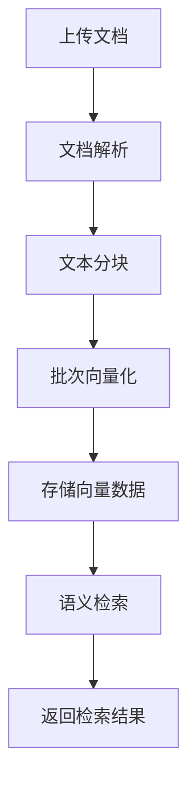

# 知识库管理

知识库管理是智能体的"私有记忆与专业智库"，通过先进的 RAG（检索增强生成）技术，将企业的私有文档、数据库、业务知识统一构建为可检索、可推理的结构化知识体系，让智能体在通用能力基础上具备企业级专业知识。

## 功能概述

- 支持四种知识库类型：百炼、Dify、RagFlow、本地
- 本地知识库支持 Ollama 和 Bailian（百炼 DashScope）两种嵌入模型提供商
- 支持自动文档分块、向量化、语义检索全流程
- 支持多种 RAG 模式配置
- 提供连接配置、端点配置、检索配置、重排配置等完整参数
- 自动健康检查与同步状态监控
- 支持元数据过滤和查询重写

## 核心概念

### 知识库类型

| 类型 | 说明 | 适用场景 |
|------|------|----------|
| **本地（LOCAL）** | 平台内置的 RAG 引擎，文档存储在本地，自动完成分块、向量化、检索 | 希望完全掌控数据隐私和检索流程的场景 |
| **百炼（BAILIAN）** | 阿里云百炼平台知识库 | 已有百炼平台知识库 |
| **Dify** | Dify 平台知识库 | 已有 Dify 知识库 |
| **RagFlow** | RagFlow 平台知识库 | 已有 RagFlow 知识库 |

### RAG 模式

| 模式 | 说明 |
|------|------|
| **GENERIC** | 每个推理步骤之前自动检索和注入知识，适合需要持续知识支持的场景 |
| **AGENTIC** | Agent 使用工具自主决定何时检索知识，适合需要灵活决策的复杂场景 |

> 注意：本地知识库节点仅生成 RAG 相关的查询接口，不直接提供同步接口。

### 配置区域

知识库配置包含以下区域：

| 区域 | 说明 | 本地知识库 |
|------|------|-----------|
| **连接配置** | 嵌入模型提供商、服务地址、维度等核心参数 | 支持 |
| **端点配置** | 检索和查询的端点地址 | 不支持（本地自动管理） |
| **检索配置** | 分块策略、Top-K、相似度阈值等 | 支持 |
| **重排配置** | 结果重排序参数 | 不支持 |
| **查询重写配置** | 查询改写和优化参数 | — |
| **元数据过滤** | 基于元数据的条件过滤 | — |
| **HTTP 配置** | 自定义 HTTP 请求参数 | — |

## 本地知识库详解

本地知识库是平台内置的 RAG 引擎，无需依赖第三方知识库服务。您只需提供嵌入模型的服务地址和凭证，平台会自动完成文档解析、分块、向量化和语义检索的全流程。

### 本地知识库工作流程

### 嵌入模型提供商

本地知识库支持两种嵌入模型提供商：

| 提供商 | 默认模型 | 默认服务地址 | 是否需要 API Key |
|--------|---------|-------------|-----------------|
| **Ollama** | `qwen3-embedding:4b` | `http://localhost:11434/api/embed` | 否 |
| **Bailian** | `text-embedding-v4` | `https://dashscope.aliyuncs.com/compatible-mode/v1/embeddings` | 是 |

切换提供商时，服务地址和嵌入模型会自动重置为对应提供商的默认值。您也可以手动修改后，点击"重置默认"按钮恢复。

### 连接配置参数说明

#### 模型提供商
- **说明**：选择嵌入模型的提供商，支持 Ollama（本地/自托管）和 Bailian（阿里云百炼 DashScope）
- **默认值**：Ollama
- **提示**：切换提供商会自动更新服务地址和模型默认值

#### API Key（仅 Bailian）
- **说明**：Bailian 平台的 API Key，Ollama 本地部署无需此项
- **环境变量支持**：支持 `${ENV_VAR}` 语法引用系统环境变量，例如 `${DASHSCOPE_API_KEY}`
- **必填**：选择 Bailian 时必填

#### 服务地址
- **说明**：嵌入模型的 API 服务地址（完整 URL，含路径）
- **Ollama 默认**：`http://localhost:11434/api/embed`
- **Bailian 默认**：`https://dashscope.aliyuncs.com/compatible-mode/v1/embeddings`
- **操作**：可手动修改，点击"重置默认"恢复当前提供商的默认地址

#### 嵌入模型
- **说明**：用于文本向量化的模型名称
- **Ollama 默认**：`qwen3-embedding:4b`
- **Bailian 默认**：`text-embedding-v4`
- **操作**：可手动修改，点击"重置默认"恢复当前提供商的默认模型

#### 向量化维度
- **说明**：输出向量的维度数，决定了向量的表达能力与存储成本
- **可选值**：64 / 128 / 256 / 512 / 768 / 1024 / 2048 / 2560
- **默认值**：1024
- **重要提示**：新增后不可修改（编辑状态下禁用）。1024 维度是性能与成本的最佳平衡点，适用于绝大多数语义检索任务。更高的维度（如 2048、2560）可获得更精细的语义表达，但会显著增加存储和计算开销
- **维度选择建议**：

| 维度 | 适用场景 |
|------|---------|
| 64-256 | 简单关键词匹配、分类任务 |
| 512-768 | 中等复杂度语义检索 |
| 1024 | 通用场景，推荐默认值 |
| 2048-2560 | 高精度专业领域检索 |

#### 响应缓冲大小
- **说明**：WebClient 内存缓冲区大小，用于接收嵌入 API 的响应
- **默认值**：50 MB
- **范围**：1-512 MB
- **提示**：大数据量时（批次大、维度高）可适当增大，避免内存溢出

#### 单批次最大文本数
- **说明**：单次请求发送的最大文本数量
- **默认值**：10
- **范围**：1-100
- **提示**：超出批次上限的文本会自动拆分为多批次请求。Bailian 和 Ollama 均有批次大小限制，默认 10 为安全值

### 检索配置参数说明

#### 分块分隔符
- **说明**：文档分块的优先级分隔符，多个分隔符用英文逗号分隔
- **支持转义**：`\n`（换行）、`\t`（制表符）、`\r`（回车）
- **示例**：`\n\n,^\|,\n` 表示优先按空行分块，其次按管道符开头、再次按单换行分块
- **默认**：留空则按字符数分块

#### 最大块长度
- **说明**：每个文本块的最大字符数
- **默认值**：512
- **范围**：128 - 8192

#### 分块重叠
- **说明**：相邻文本块之间的重叠字符数，用于保持语义连贯性
- **默认值**：64
- **范围**：0 - 1024

#### Top K
- **说明**：检索时返回的最相关文本块数量
- **默认值**：5
- **范围**：1 - 100

#### 相似度阈值
- **说明**：向量相似度的最低入围分数，低于此值的结果将被过滤
- **默认值**：0.5
- **范围**：0 - 1（步长 0.1）

## 操作指南

### 创建本地知识库

1. 在知识库管理页面点击 **添加新知识库** 卡片
2. 类型选择 **本地**
3. 选择 RAG 模式
4. 填写基本信息：名称、描述
5. 在 **连接配置** 中：
   - 选择模型提供商（Ollama / Bailian）
   - 如选 Bailian，填写 API Key
   - 确认服务地址和嵌入模型（会自动填充默认值）
   - 选择合适的向量化维度（新增后不可更改）
   - 根据需要调整缓冲大小和批次上限
6. 在 **检索配置** 中：
   - 设置分块分隔符、块长度、重叠量
   - 设置 Top K 和相似度阈值
7. 点击确定提交

### 上传文档

创建本地知识库后，进入"我的知识库"页面，点击知识库卡片 [文档] 进入详情即可上传和管理文档。

关于文档上传、解析、分块等操作的详细说明，请参考 [知识库文档管理](/knowledge#文档管理) 章节。

### 查看详情

点击卡片右上角菜单 → **查看**，查看完整配置信息，包括：

- 关联的智能体列表
- 连接配置（嵌入模型提供商、服务地址、维度等）
- 检索配置（分块策略、Top-K、相似度阈值等）
- 健康状态和最后同步时间

### 编辑配置

点击卡片右上角菜单 → **编辑**，修改知识库配置。

> **注意**：
> - 向量化维度在编辑状态下不可修改（灰显），其余配置均可调整
> - 修改知识库配置后，关联智能体将自动重新注册

### 搜索与筛选

- **类型筛选**：页面顶部分段控制器切换知识库类型（百炼 / Dify / RagFlow / 本地）
- **名称搜索**：输入关键词后回车搜索

## 在智能体中使用

在智能体配置的「知识库与 MCP」步骤中：

1. 在 **知识库** 区域，按类型折叠面板浏览
2. 勾选需要关联的知识库（Checkbox 多选）
3. 每个智能体可关联多个不同类型的知识库

## 配置说明

### 百炼知识库连接配置

- **API Key**：百炼平台 API Key
- **知识库 ID**：百炼平台中的知识库标识

### Dify 知识库连接配置

- **API Key**：Dify 平台 API Key
- **Base URL**：Dify 服务地址

### RagFlow 知识库连接配置

- **API Key**：RagFlow 平台 API Key
- **Base URL**：RagFlow 服务地址
- **知识库 ID**：RagFlow 中的知识库标识

### 元数据过滤

通过添加元数据条件，可以在检索时精确过滤文档：

- **字段名**：元数据的字段名
- **比较操作符**：`=`、`!=`、`>`、`<` 等
- **值**：过滤条件的值

## 常见问题

### 如何选择嵌入模型提供商？

- **Ollama**：适合内网环境、有自建 GPU 服务器、对数据隐私要求高的场景。无需 API Key，完全本地运行
- **Bailian**：适合已有阿里云百炼账号、希望使用云端高性能嵌入模型的场景。需要 API Key 和网络访问

### 如何选择向量化维度？

- 维度越高，向量表达能力越强，但存储和计算成本也越高
- 1024 是通用场景的最佳平衡点，能满足绝大多数语义检索需求
- 维度一旦选定不可更改（需重建知识库），请谨慎选择

### 知识库健康检查失败？

- 检查 API Key 是否正确
- 检查服务地址是否可达
- 检查网络防火墙设置
- 对于 Ollama，确认服务是否已启动：`ollama serve`

### 检索结果不准确？

- 调整 Top-K 参数（增大返回更多结果）
- 调整相似度阈值（降低阈值放宽匹配）
- 优化分块策略：减小块长度获更精细匹配，增大重叠量保持语义连贯
- 调整分块分隔符使其更贴合文档结构

### 向量化报错"批次大小无效"？

- 减小"单批次最大文本数"参数，Bailian 限制单批次不超过 10 条
- 平台会自动将大批次拆分为多批次请求，确保参数在安全范围内即可

### Ollama 模型列表为空？

- 确认 Ollama 服务已启动
- 运行 `ollama pull qwen3-embedding:4b` 拉取嵌入模型
- 运行 `ollama list` 查看已安装的模型
